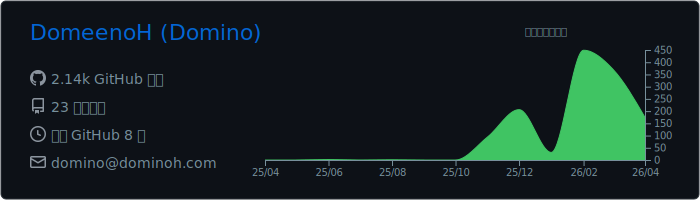
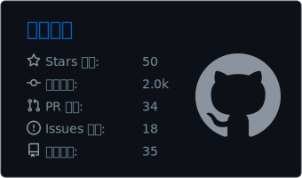
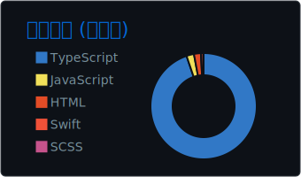

<!-- Header & Intro -->
<div align="center">
  <h3>Hey, I'm Domino! 👋</h3>
  
  <!-- Typing SVG: Dynamic Intro -->
  <a href="https://git.io/typing-svg">
    
  </a>
</div>

<div align="center">
  <p>
    🎥 Vlogger · 🎲 TRPG 云玩家 · 🐱 铲屎官 (喜欢猫咪胜过bug) · 🥕 拒绝胡萝卜<br>
    咳，又菜又爱玩，写代码只是摸鱼副业。<br>
    平时拿 GayHub 当展示柜，放一些自认为很酷炫的小玩意儿。<br>
    梦想有朝一日背着相机环球旅行 🌏。
  </p>

  <!-- Social Badges -->
  <a href="https://dominoh.com"></a>
  <a href="https://blog.dominoh.com"></a>
  <a href="https://b.dominoh.com"></a>
</div>

<hr/>

<!-- Tech Stack & Stats -->
## 🚀 Tech Stack & Stats

<div align="center">

  <!-- Skills Cloud -->
  <h4>⚡ Creative Workflow:</h4>
  <p>
    <a href="https://skillicons.dev">
      
    </a>
  </p>
  <p>
    
  </p>

  <br/>

  <!-- GitHub Stats & Top Langs -->
   <!-- Note: These images will be generated by the profile-summary-cards workflow into a folder named profile-summary-card-output -->
  <p align="center">
    
  </p>
  <p align="center">
    
    
  </p>

</div>

<!-- Projects -->
## 📌 Featured Projects


- **[FundStack](https://github.com/DomeenoH/FundStack)**: 💰 The next generation of sponsorship. 下一代赞助平台（大概）。
- **[Match-Score](https://github.com/DomeenoH/Match-Score)**: 💘 通过 50 个维度的深度扫描，计算你们灵魂的深度契合距离。因为太准了所以至今没人敢测。
- **[nevergonnagiveyouup](https://github.com/DomeenoH/nevergonnagiveyouup)**: 🎵 经典咏流传，点进去的人都哭了。

<!-- Activity & Fun -->
## 📊 Activity & Fun Stuff

<div align="center">

### ⏱️ WakaTime Stats
<!--START_SECTION:waka-->


**我是夜猫子 🦉** 

```text
🌞 早晨                     376 commits         ██░░░░░░░░░░░░░░░░░░░░░░░   09.40 % 
🌆 白天                     1441 commits        █████████░░░░░░░░░░░░░░░░   36.04 % 
🌃 傍晚                     1429 commits        █████████░░░░░░░░░░░░░░░░   35.74 % 
🌙 晚上                     752 commits         █████░░░░░░░░░░░░░░░░░░░░   18.81 % 
```


📊 **本周消耗时间** 

```text
🕑︎ 时区: Asia/Hong_Kong

💬 编程语言: 
Markdown                 8 hrs 16 mins       ███████████████████░░░░░░   74.96 % 
Other                    1 hr 3 mins         ██░░░░░░░░░░░░░░░░░░░░░░░   09.63 % 
HTML                     42 mins             ██░░░░░░░░░░░░░░░░░░░░░░░   06.38 % 
JavaScript               21 mins             █░░░░░░░░░░░░░░░░░░░░░░░░   03.27 % 
Text                     19 mins             █░░░░░░░░░░░░░░░░░░░░░░░░   03.00 % 
```

**我最常使用 JavaScript** 

```text
JavaScript               13 repos            ██████░░░░░░░░░░░░░░░░░░░   23.64 % 
HTML                     12 repos            █████░░░░░░░░░░░░░░░░░░░░   21.82 % 
TypeScript               11 repos            █████░░░░░░░░░░░░░░░░░░░░   20.00 % 
Swift                    1 repo              ░░░░░░░░░░░░░░░░░░░░░░░░░   01.82 % 
Astro                    1 repo              ░░░░░░░░░░░░░░░░░░░░░░░░░   01.82 % 
```


 Last Updated on 06/01/2026 05:08:30 UTC
<!--END_SECTION:waka-->

### ✍️ Latest Blog Posts
<!-- BLOG-POST-LIST:START -->
- [也许我只是个 Prompt 工程师：被 AI 拖着走的咖啡车开发实录](https://blog.dominoh.com/1ff6f00f.html)
- [容纳世界的噪音](https://blog.dominoh.com/68859030.html)
- [在幸福的边缘长大：我是父母爱情的“旁观者”](https://blog.dominoh.com/94dbfc8f.html)
- [像猫一样相爱：论高独立人格的舒适区](https://blog.dominoh.com/2dd7928.html)
- [我的审美洁癖：是如何把朋友一个个“清理”出局的](https://blog.dominoh.com/d7fe0211.html)
<!-- BLOG-POST-LIST:END -->
</div>

<br/>

<!-- Quote -->
<div align="center">
  <h3>🤔 Daily Dose</h3>
  <!-- QUOTE:START -->
  <i>我见青山多妩媚，料青山见我应如是。 —— 辛弃疾 《贺新郎·甚矣吾衰矣》</i>
  <!-- QUOTE:END -->
</div>

<br/>

<!-- Snake Animation -->
<div align="center">
  <b>我的贡献动态：</b>小蛇吃格子，间歇性营业 🐍
  <br/>
  <!-- Note: The snake image needs the snake workflow to run first to generate the file in the output branch -->
  <picture>
    <source media="(prefers-color-scheme: dark)" srcset="https://raw.githubusercontent.com/DomeenoH/DomeenoH/output/github-contribution-grid-snake-dark.svg">
    <source media="(prefers-color-scheme: light)" srcset="https://raw.githubusercontent.com/DomeenoH/DomeenoH/output/github-contribution-grid-snake.svg">
    
  </picture>
</div>

---

<!-- Footer & Visitor Counter -->
<p align="center">
  <sub>Thanks for visiting!</sub><br/><br/>
  

</p>
